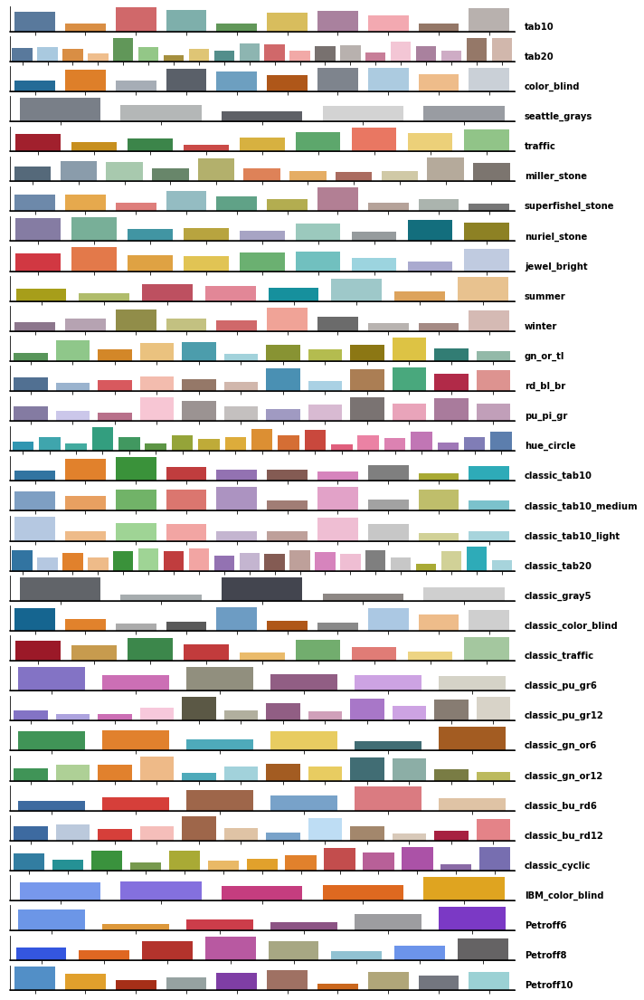

# More palettes for matplotlib and seaborn

I couldn't find a source enabling useage of the new Tableau color palettes in python (unlike R's ggplot), so I decided to add them in myself. This package currently contains the regular palettes from Tableau. You can access these palettes in two formats: `matplotlib` colormaps and `seaborn` color palettes.

### Guide

To use, simply add `from moarpalettes import get_palette`. The individual palette objects are accessed as modules eg. `get_palette.tab10()`. To then return a matplotlib cmap or seaborn palette use either `get_palette.tab10().to_mpl_cmap()` or `get_palette.tab10().to_sn_palette()`. All the available palletes and acessors are shown in the image below.



### Installation
Clone this repo, create a new venv (optional-ish), and from the base directory run

```
pip install -e ./
```

This will install the package locally.
